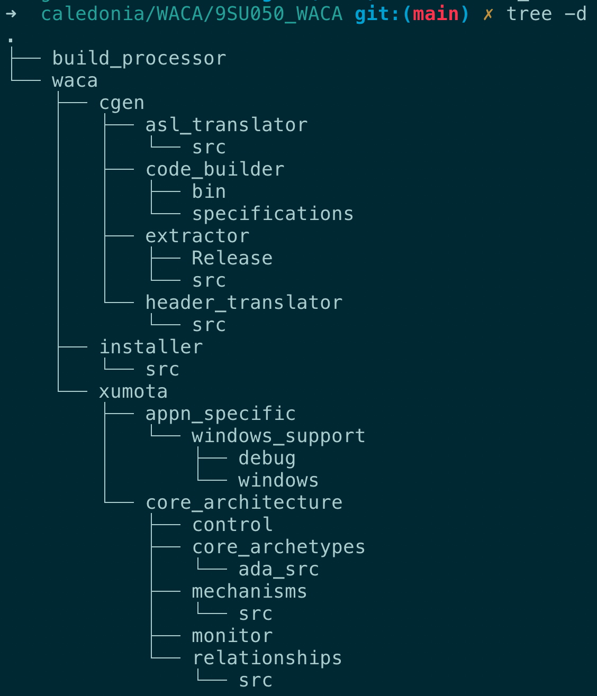

= MC-Ada Analysis

xtUML Project Analysis Note

== 1 Abstract

The Waterloo AutoCode Architecture (WACA) generates Ada for embedded and
workstation targets.  This note explores steps to creating an open source
software (OSS) replacement for WACA.

== 2 Introduction and Background

WACA generates code from files extracted from iUML and BridgePoint in a
comma-separated values flat text file format called _WASL_.  Exporters
exist which traverse the iUML and BridgePoint renditions of the Shlaer-Mellor
OOA metamodel extracting semantic information and formatting into WASL.
At the time of this analysis, WACA is encumbered with proprietary licensing
and is difficult to maintain.  The primary goal of this analysis is to
identify steps to create an open source and more maintainable Ada model
compiler that can supersede WACA.

For the purposes of this document, the new Ada model compiler will be
referred to as 'MC-Ada'.

== 3 Requirements

=== 3.1 Source Ada Compatibility

MC-Ada shall generate Ada source code functionally compatible with the
code generated by WACA.

=== 3.2 Incremental Obsolescence

The project shall be structured to replace functional components of WACA
piece by piece.

=== 3.3 Open Source Software

MC-Ada will be licensed with the same or similar strategy as the larger
body of xtUML source code.  Apache 2.0 will be the default license unless
a compelling reason is established for something different.

=== 3.4 Ease of Use

A command line and GUI interface shall be supplied for MC-Ada.  MC-Ada
shall be as easy to use as WACA.

=== 3.5 Ease of Extension

The maintainability of MC-Ada shall be substantially better than WACA.

=== 3.6 Model Compiler Best Practices

Current industry best practices shall be applied to the overall design
of MC-Ada.  This includes model-based model compiler design techniques.

== 4 Analysis

=== (Meta) Models

* ASL sytax tree (flex/bison)
* Model of ASL activity.
* File format of structural WASL.
* Perl model of structural WASL.

Available models to consider:

* masl
* Ciera
* Stratus

=== 4.1 ASL Translator

WACA translates the ASL action bodies of functions, state actions, operations
and bridges with a flex/bison parser (originally lex/yacc) called
'asl_translator' and 'Cat'.

The ASL translator is implemented in C.

The parser populates a model constructed as a C struct with a union of
members.  These are linked in a "statement tree" with statement nodes.

The abstract syntax tree (AST) is effectively a super/subtype hierarchy.

The asl_translator then walks the tree and prints (with printf statements)
the Ada statements and expressions.

The statement generation functions could possibly be mapped to operations
on the classes in the OOA of Ada Statement and Expression.

=== Structural Generation

The structural Ada could possibly be generated from the OOA of MASL
(mc/models/masl), but this may not be the best choice.

WACA structural generation does the following:

. Loads WASL files into Perl records.
  * Consider modeling these records.
. Traverses the records applying templates (still need to see how this works).

=== Interface (XML) Generation

=== Build Specifications
==== Build Specification Definition

=== WACA File Tree

=== STEPS

. Phase I (2021)
  .. Document fundamentals of WACA.
     ... modules
     ... flow
     ... runtime architecture
  .. Select base model compiler for translating xtUML to Ada (MC3020-C or
     Ciera-Java).
  .. Jump start the development environment with a "tall, thin slice" that
     addresses the build chain and command line user interface from top to
     bottom with a small subset of structural model element translation.
  .. Define template strategy.
  .. Build initial model of Ada structure.
  .. Translate SWATS classes and attributes (and possibly partial
     association and state machine elements).
  .. Prepare Software Requirements Specification (SRS) for 2021-2024
     development.
  .. Prepare Statement of Work (SOW) for each of 2022-2024 development
     efforts.
. Phase II (2022)
  .. Draft engineering analysis and design documentation for a model of
     ASL activity (action language).
  .. Build an OOA of ASL activity.
  .. Parse ASL and populate model of ASL.
  .. Extend model of structural Ada to complete classes and associations.
  .. Build a syntax checker that can be used to check ASL syntax before
     code generation.
. Phase III (2023)
  .. Draft engineering analysis and design documentation for a model of
     Ada activity.
  .. Build a target model of Ada activity.
  .. Produce templates to emit Ada activity text.
  .. Extend model of structural Ada to complete state machines.
. Phase IV (2024)
  .. Model and generate runtime architecture.
  .. Stitch runtime architecture, structural elements and activity
     generation into a cohesive whole.
  .. Build the interactive user interface.
  .. Produce user documentation to be accessible within the tool in the
     Help system and also available online via a web browser.
  .. Complete engineering design documentation.

These are the steps proposed for MC-Boj.

. SRS, SOW, Project Plan, Analysis Documentation
. Jump Start [not needed for WACA]
. Runtime Architecture
. Action Language Translation [WACA can leverage the asl-translator]
. Structural Code Generator
. Integrated Model Compiler

=== THOUGHTS

* Produce a WACA design document explaining the structure of WACA in a
  way useful for making design decisions going forward.
* General file handling, build set-up and invocation of the GNAT compiler
  should be out of scope.  This project should focus on translating xtUML
  to Ada source.  This factors out the build_processor Perl script.
  ** With this consideration in place, the MC-Boj approach may be attractive.
     Consider an incremental approach to building out the model of the model
     compiler.  Compare generated output with WACA.
* Consider making the interfaces, XML and build support out of scope.
* Consider structural model and activity translation separately.
* If there is a model of the action language expressed as C structs,
  then convert that to a class model (OOA of ASL).
  ** The C struct model of statement could be ported to an xtUML class
     diagram directly if that were expedient.
* Perl can invoke anything.  So, we can replace any subroutine from code_builder.pl.
* The build is broken down:
  ** project structure
  ** project ASL
  ** domain structure
  ** domain ASL
  ** interfaces
  ** "support"
* head_proc1.pl contains a target metamodel (of a sort) implemented as Perl sets.

* model compiler components
  ** structural generation
  ** target model (implemented as Perl data sets)
  ** ASL parser
  ** AST (model of ASL)
  ** user interface (menu system)

* Eventually, WASL will not be necessary.

== 5 Work Required

== 6 Acceptance Test

== 7 Document References

. [[dr-1]] https://support.onefact.net/issues/12113[12113 - WACA compatible MC-Ada Assessment]

---

This work is licensed under the Creative Commons CC0 License

---
