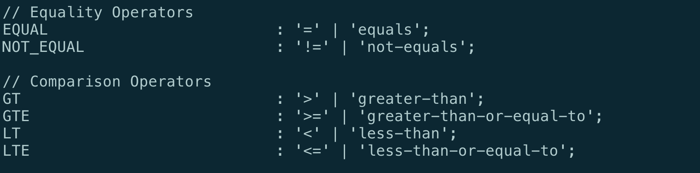
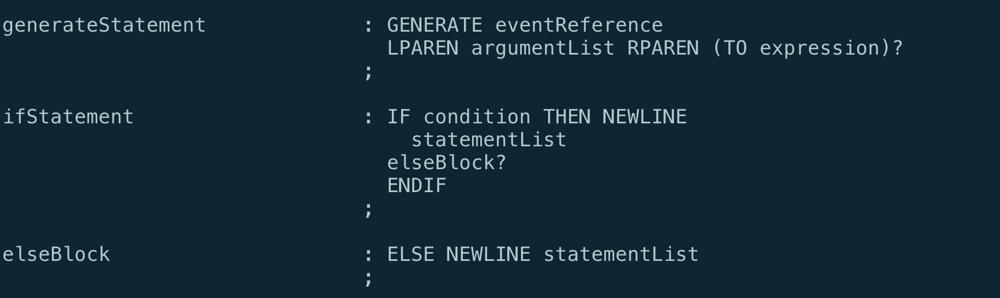

= MC-Ada Phase II ASL Parser and Loader

xtUML Project Analysis Note

== 1 Abstract

This note documents the ASL parser, loader and OOA of ASL.

== 2 Introduction and Background

MC-Ada is a 4-year project designing and implementing a model compiler for
translating xtUML models carrying ASL activities into Ada.  The second year
phase (Phase II) focused on the action language.  The primary deliverable
is a "front end" to a model compiler that takes as input the xtUML models
with ASL activities, parses them and populates a meta-model.  To
demonstrate functionality, the executable reports the successful parsing
of each action and/or reports errors in the syntax.  Additionally, after
the model is parsed and loaded, queries are run against the populated
meta-model, and an inventory is given of the various subtypes of ASL statements.

== 3 Requirements

=== 3.1 ASL Lexical Analysis

. Lexical analysis of ASL action language shall be accomplished to tokenise
  the input lines of action language.
. The lexical analysis shall be stateless as far as is practical.
  Exceptions may include tokenising the internals of comments, descriptions
  and inline code.

=== 3.2 ASL Parsing

. A context-free grammar shall be specified to parse the token stream from
  the lexical analysis.
. The choice of names for the production rules in the grammar shall be
  such as to promote readability and even to provide linkage the OOA of
  Activity.

=== 3.3 OOA of ASL Activity

. A class diagram shall be employed to semantically capture the results of
  the parsing of bodies of ASL action language.
. It is desirable that the OOA of ASL Activity be consistent with other
  action languages supported by BridgePoint, namely MASL.
. The statement and expression elements in the OOA of ASL Activity shall
  be related to the structural elements of xtUML (e.g. _class_, _attribute_,
  _association_, _state_) as appropriate.

=== 3.4 Populating the OOA

. Salient elements parsed from activity bodies shall be stored as
  instances in the ASL metamodel.
. Instances in the OOA of ASL Activity shall be linked to one another to
  preserve their semantic inter-relatedness.

=== 3.5 Testing the Populated OOA

For MC-Ada Stage II, no code is generated.  So, a temporary feature will
be added to demonstrate that activity bodies were correctly parsed and
populated into the metamodel.

. A query shall be provided that produces an inventory of the populated
  OOA of ASL Activity.

NOTE:  It is noted that additional testing of the populated OOA of ASL
       Activity was accomplished in a concurrent project which began the
       translation of ASL into MASL (<<dr-2>>).

== 4 Analysis

This second stage of the construction of a model compiler targeting Ada is
strikingly unrelated to Ada.  The parsing and loading of ASL into an
abstract metamodel is target independent.  Ada-specific work will continue
in the third stage of MC-Ada development.

=== 4.1 ASL Lexical Analysis

There were a couple of choices for lexical analysis.  The first and
perhaps most obvious choice was to leverage the existing ASL Translator
implemented in `lex` (actually, `flex`).  This translator is used in the
existing WACA.  It is tested, tried and true.

However, basing the activity parsing of MC-Ada on the existing ASL
Translator has two disadvantages.

. It locks the parser into the flex/bison tool chain, while most of the
  BridgePoint tool chain is using more Java-centric utilities, namely `antlr`.
. Secondly, the ASL Translator stands completely separate from work that
  has been done on MASL.

Therefore, this option was not chosen.

`antlr` was chosen as the lexical analysis (and parsing) technology, and a
strategy was employed to perform lexical analysis in a fashion similar to
the lexical analysis of MASL.  While ASL and MASL are lexically different,
the ASL lexer was structured to allow comparison and contrast between the
two languages.  This has proven useful in the development.

`antlr` supports recursive descent Backus-Naur form grammars and generates
Java executables for lexical analysis, parsing and abstract syntax tree
(AST) creation.  It also provides mechanisms for "walking" the
resultant AST.

The ASL lexer exists as an `antlr` tokeniser in `AslLexer.g`.

.Fragment of ASL Lexer Source

=== 4.2 ASL Parsing

The choice for parsing strategy followed the same reasoning as that for
the lexical analysis.  `antlr` is the chosen technology, and a strategy of
"congruence" with MASL is taken.

By building an ASL parser side-by-side to the MASL parser, the
similarities and differences of the languages could be clearly analysed.
It cannot overstated how much this influenced the development.  (It was
also a fascinating study in the underlying computer science of two
distinct Shlaer-Mellor action languages.)

The ASL parser exists as an `anltr` grammar in `AslParser.g`.

.Fragment of ASL Parser Grammar

=== 4.3 OOA of ASL Activity

Four alternatives existed with regard to producing a Shlaer-Mellor class
diagram of the semantics of ASL.  The four options were:

. Build the OOA of ASL from scratch.
. Obtain an existing OOA of ASL.
. OOA of OAL
. OOA of MASL

The choice of building the model from scratch was considered the least
desirable.  It represents the most work and carries no benefit of
congruency with an existing OOA of Activity.

An OOA of ASL exists in industry.  The people in possession of this model
were invited to share it with the project.  These people claimed that the
model was deficient for our purposes and declined to share it.

ASL and OAL are similar action languages.  They have different syntaxes but
virtually identical semantics.  There is a near one-to-one correspondence
between statements, and expressions are also quite similar.  The OOA of
OAL is mature and has been used to generate code for many years.  This was
a solid consideration as a starting point for the OOA of ASL.

The OOA of MASL is the choice that was taken.  The OOA of MASL is seeing
active development.  This model has the following advantages.

* The class diagram for the OOA of MASL is maintained separately from any
  activities for editing, execution and/or translation.  The OOA of OAL
  carries these activities mixed in with the class diagram making it more
  difficult to work with.
* The OOA of MASL is influencing the future of xtUML both as a language
  and as tooling (BridgePoint).
* The MASL action language is a superset of the other existing action
  languages.  And therefore, the OOA of MASL is a superset of any of the
  other metamodels.  Confidence is high that it can "contain" and
  "represent" any  of the alternative action languages.
* It was considered interesting, from a computer science standpoint, at
  the beginning of the project to see if the OOA of MASL could contain an
  instance population parsed from a different action language.  This has
  turned out to be true.

The OOA of MASL is being used, largely unmodified, to contain the parsed
ASL action bodies.  This was the choice.

The OOA of ASL is a branch of the OOA of MASL and will be merged at the
appropriate time in the project.  It is in the xtuml/mc repository as
`models/ooamasl` and `models/stratus`.

==== 4.3.1 OOA of (M)ASL Activity

The source model for the OOA of ASL Activity and for the modelled
activities used to load and populate can be edited with BridgePoint.  Here
are a few key diagrams for convenience.

* link:masl_subsystems.png[**Model Explorer View of MASL Subsystems**]
* link:masl_statement.png[**OOA of (M)ASL Statement Subsystem**]
* link:masl_expression.png[**OOA of (M)ASL Expression Subsystem**]

=== 4.4 Populating the OOA

The process used to "decorate" the OOA of Activity with instances parsed
from the action language takes three steps.

. Tokenise the action body with the lexical analyser (_lexer_).
. Parse the statements and expressions in the resulting token stream.
  Parsing results in an abstract syntax tree (AST) which is automatically
  derived and produced by `antlr` from the parser grammar.
. "Walk" the abstract syntax tree using a visitor pattern technique.  Tree-walking
  provides a place to perform the 'creates', 'relates' and attribute
  initialisation in the OOA of Activity.

The Ciera model compiler being used by this project provides an interface
between Java code (in our case the parser/loader) and a translated model.
Some of the populating of the OOA of Activity is done directly in the
tree-walker using this interface.  However, most of the work is done by
action language domain functions in the model of the model compiler.

The ASL populator exists as Java source in `AslPopulator.java`.  The
modelled portions exist in `models/stratus`.

=== 4.5 Testing the Populated OOA

A (perhaps temporary) feature was added the model of the model compiler.
After the parsing and loading of a set of activities is complete, a domain
function runs which selects (finds) instances of the various statement
types and simply counts them.  It outputs the tally for each statement
type enabling consistency checking for testing purposes.

== 5 Work Required

(as outlined in the Analysis)

== 6 Acceptance Test

A stand-alone executable was built which takes as input a domain exported
from BridgePoint as MASL but having ASL for all activity bodies.  The
executable lexes, parses, loads and queries both the structural MASL and
the ASL activities.  The output is either syntax errors or an inventory of
the parsed and loaded ASL.

=== 6.1 SWATS

Run the executable against the entire body of SWATS test models.

=== 6.2 Production Models

Run the executable against the entire body of production models.

== 7 Document References

. [[dr-1]] https://support.onefact.net/issues/12289[12289 - OOA of ASL Engineering Documentation]
. [[dr-2]] https://support.onefact.net/issues/12571[12571 - Convert ASL to MASL.]

---

This work is licensed under the Creative Commons CC0 License

---

